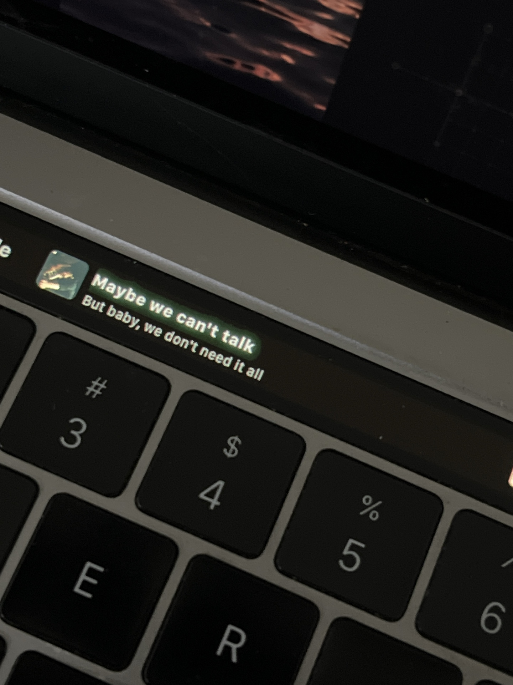
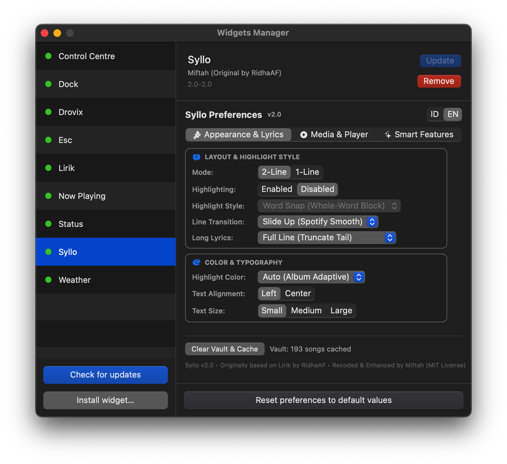
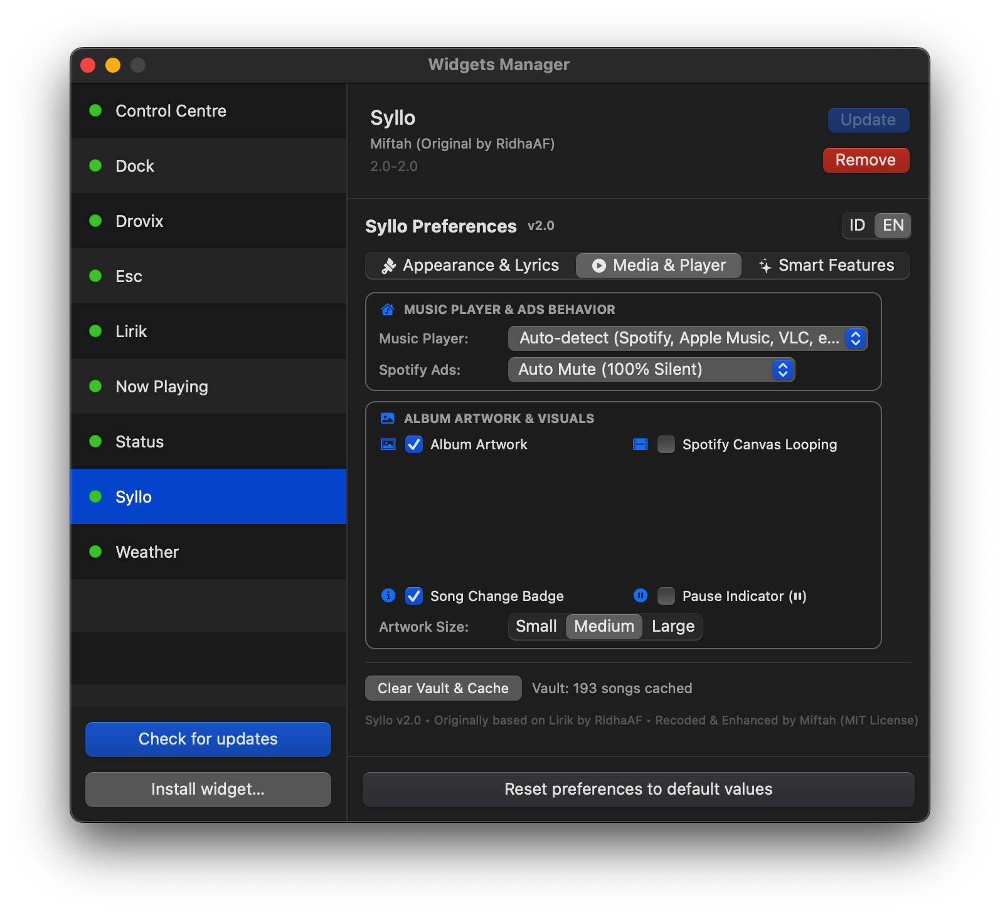
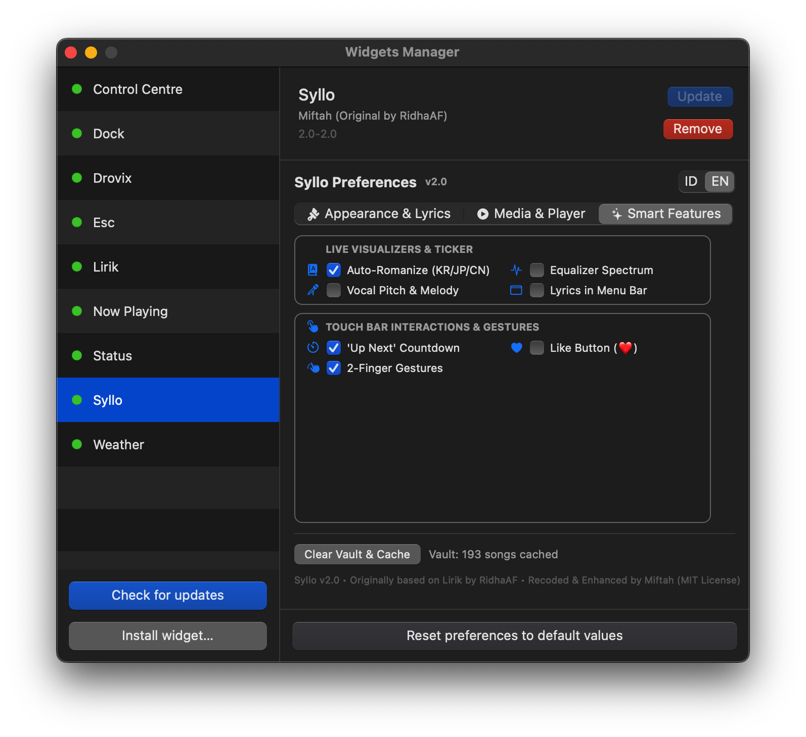

# 🎵 Syllo — Apple-Style Synced Lyrics for macOS Touch Bar

<p align="center">
  
</p>

<p align="center">
  
  
  
  
  
</p>

**Syllo** is a high-performance, open-source macOS lyrics companion and Touch Bar widget that delivers real-time, buttery-smooth synchronized lyrics with **Apple Music Sing-style word-by-word karaoke highlighting**.

Re-engineered from the ground up by **Miftah** for **macOS Ventura 13.0+** (including Sonoma & Sequoia), featuring native integration with **Spotify**, **Apple Music**, **IINA**, **QuickTime Player**, and **VLC**.

---

## 📸 Screenshots & Preference UI

Syllo features a modern grouped card preference interface built with **100% native Apple SF Symbols** and an instant real-time **Bilingual Switcher (`[ ID | EN ]`)**.

<p align="center">
  
  
  
</p>

* **Tab 1 (Appearance & Lyrics):** Dual/Single line layout, Highlighting ON/OFF switch, Highlight Styles (Word Snap, Line Focus, Word Pill, Smooth Sweep), Line Transition animations (Slide Up, Crossfade, Spring Pulse, Instant), Long lyric truncation/splitting, Adaptive album colors, Alignment & Font size.
* **Tab 2 (Media & Player):** Music player auto-detection, Spotify ad auto-mute / ducking, Dynamic album artwork, Spotify Canvas looping videos, Track info badges, and Pause indicators.
* **Tab 3 (Smart Features):** Asian script auto-romanization (KR/JP/CN), Audio equalizer spectrum, Vocal pitch & melody meter, Menu bar lyrics, Up-next countdown, Touch Bar Like button (❤️), and 2-finger multi-touch gestures.

---

## 🌟 Key Features

### 🎤 Apple Music Sing-Style Karaoke Highlighting
* **Character & Word-by-Word Progressive Fill:** Smooth real-time gradient wipe illuminating each word and syllable in sync with the singer's voice.
* **4 Highlight Styles:**
  1. **Word Snap (Whole-Word Block):** Clean, instantaneous step-by-step block illumination per word.
  2. **Apple Music Line Focus:** Lights up the active line with a gentle glow while keeping the rest dimmed.
  3. **Word Pill (Capsule Bubble):** Draws a rounded capsule background behind the currently sung word.
  4. **Smooth Karaoke Sweep:** Continuous horizontal color sweep across syllables.
* **Highlighting ON / OFF Switch:** Toggle between real-time karaoke illumination and crisp, full-brightness static lyrics.
* **Smooth Line Transitions:**
  * **Slide Up (Spotify Smooth):** New lyrics glide upwards smoothly from the bottom.
  * **Smooth Crossfade:** Seamless alpha fade between incoming and outgoing lines.
  * **Spring Pulse:** Subtle elastic bounce when a new lyric line arrives.
  * **Instant:** Immediate text replacement without transition animation.
* **Phase-Locked Loop (PLL) Audio Clock:** Zero clock jitter, no rubber-banding backwards, and monotonic 60 FPS interpolation.

### 🎬 Multi-Player & Video Support
* **Spotify & Apple Music:** Native AppleScript & MediaRemote integration with album art extraction and 1-tap Heart/Like support.
* **IINA Video Player:** High-precision native IPC bridge (`io.iina.lirik.iinaplugin`) reading `libmpv` state with microsecond accuracy.
* **QuickTime Player & VLC:** Real-time document title, elapsed seconds, and play/pause tracking.

### 🪟 4 Display Modes & Surfaces
1. **Touch Bar Widget:** Dual-line karaoke, dynamic album artwork, animated equalizer, and live vocal pitch meter.
2. **macOS Menu Bar Ticker:** Live scrolling lyric text in the top system status bar with quick playback controls.
3. **Floating Desktop HUD:** Draggable, stay-on-top Picture-in-Picture window with album artwork and circular progress indicator.
4. **Fullscreen Ambient Window:** Immersive Apple TV-style ambient display with glassmorphism blur and streaming **Spotify Canvas looping videos**.

### 🖐️ Interactive Touch Bar Multi-Touch Gestures
| Gesture | Action |
| :--- | :--- |
| **Single Tap** | Toggle Play / Pause |
| **Double Tap** | Toggle Floating Desktop HUD |
| **Long Press (0.5s)** | Toggle Fullscreen Ambient Mode |
| **Horizontal Pan / Drag** | Precision timeline scrubbing with real-time target timestamp preview |
| **Two-Finger Swipe Left / Right** | Previous / Next track skip |
| **Two-Finger Swipe Up / Down** | Direct volume control with on-screen percentage indicator |
| **Tap Heart Button (♥)** | Like / Save current track to library |

### 🧠 Smart Sanitization & Search
* **Intelligent Title & Noise Parser:** Strips video resolutions `(1080p, 720p)`, video codecs `(h264, hevc)`, tags (`Lirik Terjemahan Indonesia`, `Sub Indo`, `[Lyric Video]`, `(Official Music Video)`), and uploader suffixes (`- hanhan`).
* **3-Tier LRCLIB Search Engine:** Performs Exact Lookup ➔ Swapped Artist/Title Lookup ➔ Fuzzy Search scoring to maximize match rates for live concerts, covers, and local video files.
* **Spotify Ad Auto-Mute / Ducking:** Automatically mutes or fades down volume during audio advertisements and smoothly restores audio when the next song begins.
* **Asian Script Romanization:** Instant Romaji (Japanese Kanji/Kana), Pinyin (Chinese Hanzi), and Romaja (Korean Hangul) pronunciation guides displayed on the secondary line.
* **Offline Lyrics Vault & Offset Fine-Tuner:** Adjust lyric timing in real-time ($\pm0.5\text{s}$) with persistent local caching in `~/Library/Application Support/Pock/lirik_vault.json`.

---

## 📝 Changelog (v2.0 Enhanced Edition)

### 🚀 Major Improvements & New Features
* **Project Rebrand & Architecture:** Renamed project to **Syllo** with full MIT license preservation, dual-architecture Universal Binary (`arm64` + `x86_64`), and backwards-compatible runtime aliases (`LirikWidget`, `LirikPreferenceViewController`).
* **Highlighting & Style Customization:**
  * Added **Highlighting ON / OFF** master switch.
  * Added **Word Snap**, **Line Focus**, **Word Pill**, and **Smooth Sweep** rendering styles.
* **Line Transition Animation Engine:**
  * Integrated **Slide Up**, **Smooth Crossfade**, and **Spring Pulse** animations directly into `KaraokeLyricView` for seamless transitions between lyric lines.
* **Modern Settings UI:**
  * Redesigned preferences into clean Drovix-style rounded cards.
  * Swapped all text emojis for crisp native **Apple SF Symbols**.
  * Added real-time **Bilingual Toggle (`[ ID | EN ]`)** supporting Indonesian and English dynamically without app restart.
  * Added **Live Cache & Vault Status** indicator with 1-click purge button.
* **Touch Bar Multi-Touch & Scrubbing:**
  * Real-time 1-finger drag scrubber with target timestamp display.
  * 2-finger volume control and track skipping.
  * 1-tap Heart button for Spotify & Apple Music.
* **Multi-Surface & Ambient Playback:**
  * Added Floating Desktop Picture-in-Picture HUD.
  * Added macOS Menu Bar lyric ticker.
  * Added Fullscreen Ambient display with Spotify Canvas looping video playback.
* **Sync Engine & Timekeeping:**
  * Implemented Phase-Locked Loop (PLL) clock synchronization to eliminate jitter and drift.
  * Syllable-weighted vocal cadence model for natural pacing on word-by-word lyrics.
* **IINA & VLC Bridge:**
  * Added native `libmpv` IPC socket connection for microsecond-precise video player lyric synchronization.

---

## 💻 System Requirements

* **macOS:** macOS Ventura 13.0 or later (fully compatible with macOS 13 Ventura, macOS 14 Sonoma, and macOS 15 Sequoia+).
* **Architecture:** Universal Binary (`arm64` Apple Silicon + `x86_64` Intel).
* **Host App:** [Pock](https://pock.app) (v0.9.0 or later).
* **Supported Players:** Spotify (Free/Premium), Apple Music, IINA (with plugin), QuickTime Player, VLC.

---

## 🚀 Installation & Setup

### Step 1: Install Pock
1. Download and install **Pock** from [pock.app](https://pock.app) or via Homebrew:
   ```bash
   brew install --cask pock
   ```
2. Launch Pock and grant required permissions (*Accessibility*, *Automation*, and *Screen Recording* if prompted for visualizers).

### Step 2: Download & Install Syllo
1. Download **`syllo-ventura13.zip`** (or `Syllo.pock`) from releases.
2. Unzip the file if needed.
3. Open **Terminal** and remove quarantine attribute:
   ```bash
   xattr -cr ~/Downloads/Syllo.pock
   ```
4. Copy `Syllo.pock` to Pock widgets folder:
   ```bash
   cp -R ~/Downloads/Syllo.pock ~/Library/Application\ Support/Pock/Widgets/
   ```
5. Restart Pock (`killall Pock && open /Applications/Pock.app`).

### Step 3: Add to Touch Bar Layout
1. Open **Pock Preferences** (⌘,).
2. Go to **Widgets Manager** and ensure **Syllo** is enabled (green dot).
3. Click **Customize Pock...** and drag **Syllo** onto your Touch Bar layout.
4. Play any song on Spotify or Apple Music!

---

## 🛠️ Building from Source

To compile the standalone Universal Binary (`x86_64` + `arm64`) for macOS Ventura 13.0+:

```bash
# 1. Clone repository
git clone https://github.com/miftahganzz/syllo.git
cd syllo

# 2. Compile Universal Binary with swiftc
swiftc -target x86_64-apple-macosx13.0 \
  -module-name syllo -emit-library \
  -F /Applications/Pock.app/Contents/Frameworks \
  -framework AppKit -framework Foundation -framework ApplicationServices \
  -framework AVFoundation -framework QuartzCore -framework PockKit -framework TinyConstraints \
  -Xlinker -bundle -Xlinker -rpath -Xlinker @loader_path/../Frameworks \
  $(find lirik/Sources -name "*.swift") -o /tmp/syllo_x86_64

swiftc -target arm64-apple-macosx13.0 \
  -module-name syllo -emit-library \
  -F /Applications/Pock.app/Contents/Frameworks \
  -framework AppKit -framework Foundation -framework ApplicationServices \
  -framework AVFoundation -framework QuartzCore -framework PockKit -framework TinyConstraints \
  -Xlinker -bundle -Xlinker -rpath -Xlinker @loader_path/../Frameworks \
  $(find lirik/Sources -name "*.swift") -o /tmp/syllo_arm64

# 3. Create Universal Binary and bundle
lipo -create -output dist/Syllo.pock/Contents/MacOS/syllo /tmp/syllo_x86_64 /tmp/syllo_arm64
codesign -f -s - dist/Syllo.pock
```

---

## 👥 Contributors & Credits

* **Syllo (Enhanced Edition & Recode)**: **Miftah** ([@miftahganzz](https://github.com/miftahganzz)) — Word-by-word Apple-style karaoke, IINA native IPC bridge, Phase-Locked Loop clock sync, Multi-tier smart search, Desktop HUD & Ambient mode, bilingual UI, highlight and animation engine.
* **Original Creator of Lirik**: [@RidhaAF](https://github.com/RidhaAF) — Initial concept & core Pock widget architecture.
* **Contributor**: [@rizkifdh](https://github.com/rizkifdh) — Permission fix, album artwork thumbnail.

---

## 📄 License

This project is open-source and licensed under the **[MIT License](LICENSE)**:
* Original Work © 2024 Ridha Ahmad Firdaus
* Syllo (Enhanced Edition) © 2026 Miftah
