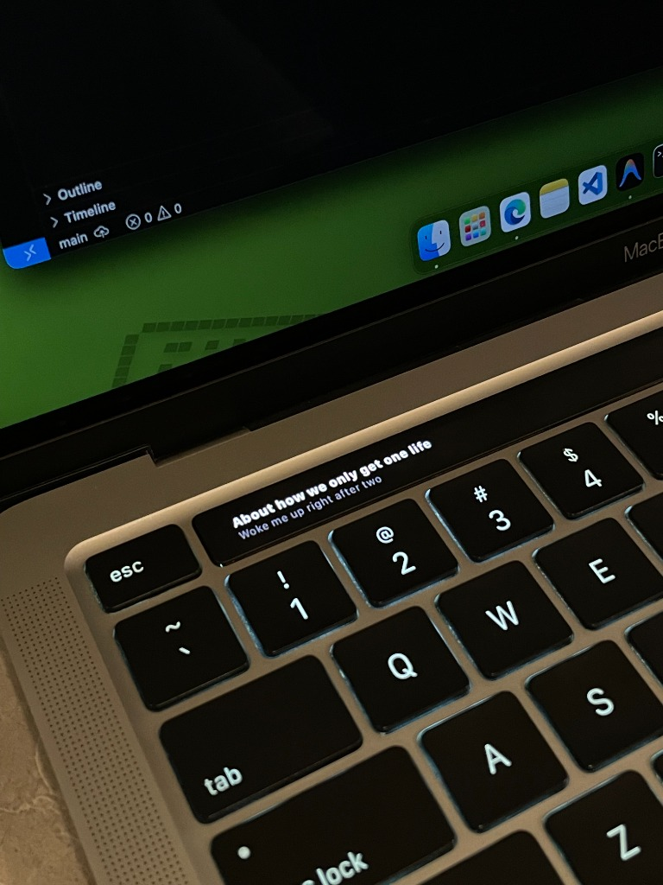

# 🎵 Lirik (Enhanced Edition) — Apple-Style Synced Lyrics for macOS

<p align="center">
  
</p>

<p align="center">
  
  
  
  
</p>

**Lirik (Enhanced Edition)** is a high-performance macOS lyrics companion and Touch Bar widget that delivers real-time, buttery-smooth synchronized lyrics with **Apple Music Sing-style word-by-word karaoke highlighting**.

Re-engineered from the ground up by **Miftah** for **macOS Ventura 13.0+** (including Sonoma & Sequoia), featuring native integration with **Spotify**, **Apple Music**, **IINA**, **QuickTime Player**, and **VLC**.

---

## 🌟 Highlights & Key Features

### 🎤 Apple Music Sing-Style Karaoke
* **Character & Word-by-Word Progressive Fill:** Smooth real-time horizontal gradient wipe that illuminates each word and syllable in sync with the singer's voice.
* **Natural Vocal Cadence Model:** Syllable-weighted timing with cosine S-curve easing and natural vocal breath pauses before line transitions.
* **Phase-Locked Loop (PLL) Audio Clock:** Zero clock jitter, no rubber-banding backwards, and monotonic 60 FPS interpolation.

### 🎬 Multi-Player & Video Support
* **Spotify & Apple Music:** Native AppleScript & MediaRemote integration with album art extraction and 1-tap Heart/Like support.
* **IINA Video Player:** High-precision native IPC bridge (`io.iina.lirik.iinaplugin`) reading `libmpv` state with microsecond accuracy.
* **QuickTime Player & VLC:** Real-time document title, elapsed seconds, and play/pause tracking.

### 🪟 4 Display Modes & Surfaces
1. **Touch Bar Widget:** Dual-line karaoke, dynamic album artwork, animated equalizer, and live vocal pitch meter.
2. **macOS Menu Bar Ticker:** Live scrolling lyric text in the top system status bar with quick playback controls.
3. **Floating Desktop HUD:** Draggable, stay-on-top Picture-in-Picture window with album artwork and circular progress indicator.
4. **Fullscreen Ambient Window:** Immersive Apple TV-style ambient display with glassmorphism blur and streaming **Spotify Canvas looping videos**.

### 🖐️ Interactive Touch Bar Multi-Touch Gestures
| Gesture | Action |
| :--- | :--- |
| **Single Tap** | Toggle Play / Pause |
| **Double Tap** | Toggle Floating Desktop HUD |
| **Long Press (0.5s)** | Toggle Fullscreen Ambient Mode |
| **Horizontal Pan / Drag** | Precision timeline scrubbing with real-time target timestamp preview |
| **Two-Finger Swipe Left / Right** | Previous / Next track skip |
| **Two-Finger Swipe Up / Down** | Direct volume control with on-screen percentage indicator |
| **Tap Heart Button (♥)** | Like / Save current track to library |

### 🧠 Smart Sanitization & Search
* **Intelligent Title & Noise Parser:** Strips video resolutions `(1080p, 720p)`, video codecs `(h264, hevc)`, tags (`Lirik Terjemahan Indonesia`, `Sub Indo`, `[Lyric Video]`, `(Official Music Video)`), and uploader suffixes (`- hanhan`).
* **3-Tier LRCLIB Search Engine:** Performs Exact Lookup ➔ Swapped Artist/Title Lookup ➔ Fuzzy Search scoring to maximize match rates for live concerts, covers, and local video files.
* **Spotify Ad Auto-Mute / Ducking:** Automatically mutes or fades down volume during audio advertisements and smoothly restores audio when the next song begins.
* **Asian Script Romanization:** Instant Romaji (Japanese Kanji/Kana), Pinyin (Chinese Hanzi), and Romaja (Korean Hangul) pronunciation guides displayed on the secondary line.
* **Offline Lyrics Vault & Offset Fine-Tuner:** Adjust lyric timing in real-time ($\pm0.5\text{s}$) with persistent local caching in `~/Library/Application Support/Pock/lirik_vault.json`.

---

## 💻 System Requirements

* **macOS:** macOS Ventura 13.0 or later (fully compatible with macOS 13 Ventura, macOS 14 Sonoma, and macOS 15 Sequoia+).
* **Architecture:** Universal Binary (`arm64` Apple Silicon M1/M2/M3/M4 & `x86_64` Intel MacBooks with Touch Bar).
* **Host Application:** [Pock](https://pock.app) (v0.9.0 or later).

---

## 📥 Installation Guide

### Step 1: Install Pock
If you haven't already, download and install **Pock**:
👉 **Download Pock**: [https://pock.app](https://pock.app)

---

### Step 2: Download & Install Lirik
1. Download **`lirik-ventura13.zip`** (or `lirik.pock`) from the repository releases.
2. Unzip the file to your `Downloads` folder.
3. **Clear macOS Quarantine (Important):**
   To prevent macOS Gatekeeper from displaying *"lirik.pock is damaged and can't be opened"* or Pock's `error.invalid-bundle`, run this command in **Terminal**:
   ```bash
   xattr -cr ~/Downloads/lirik.pock
   ```
4. Double-click **`lirik.pock`** to install, or copy manually:
   ```bash
   cp -R ~/Downloads/lirik.pock ~/Library/Application\ Support/Pock/Widgets/
   ```

---

### Step 3: Enable Widget in Pock
1. Click the **Pock** icon in your macOS menu bar ➔ **Manage widgets...**
2. Ensure **Lirik** is enabled (green indicator dot).
3. Click **Customize Pock...** and drag **Lirik** onto your physical Touch Bar layout.

---

### Step 4: macOS Permissions Setup
When playing a song for the first time:
* macOS will prompt for **Automation Permission** to control Spotify / Music / System Events. Click **Allow**.
* If permission was previously denied, go to **System Settings ➔ Privacy & Security ➔ Automation** and ensure **Pock** has permission enabled for your media players.

---

## 🛠️ Building from Source

To compile the standalone Universal Binary (`x86_64` + `arm64`) for macOS Ventura 13.0+:

```bash
# 1. Clone repository
git clone https://github.com/miftahganzz/lirik.git
cd lirik

# 2. Compile Universal Binary with swiftc
swiftc -target x86_64-apple-macosx13.0 \
  -module-name lirik -emit-library \
  -F /Applications/Pock.app/Contents/Frameworks \
  -framework AppKit -framework Foundation -framework ApplicationServices \
  -framework AVFoundation -framework QuartzCore -framework PockKit -framework TinyConstraints \
  -Xlinker -bundle -Xlinker -rpath -Xlinker @loader_path/../Frameworks \
  $(find lirik/Sources -name "*.swift") -o /tmp/lirik_x86_64

swiftc -target arm64-apple-macosx13.0 \
  -module-name lirik -emit-library \
  -F /Applications/Pock.app/Contents/Frameworks \
  -framework AppKit -framework Foundation -framework ApplicationServices \
  -framework AVFoundation -framework QuartzCore -framework PockKit -framework TinyConstraints \
  -Xlinker -bundle -Xlinker -rpath -Xlinker @loader_path/../Frameworks \
  $(find lirik/Sources -name "*.swift") -o /tmp/lirik_arm64

# 3. Create Universal Binary and bundle
lipo -create -output dist/lirik.pock/Contents/MacOS/lirik /tmp/lirik_x86_64 /tmp/lirik_arm64
codesign -f -s - dist/lirik.pock
```

---

## 👥 Contributors & Credits

* **Enhanced Edition & Recode**: **Miftah** ([@miftahganzz](https://github.com/miftahganzz)) — Word-by-word Apple-style karaoke, IINA native IPC bridge, Phase-Locked Loop clock sync, Multi-tier smart search, Desktop HUD & Ambient mode.
* **Original Creator**: [@RidhaAF](https://github.com/RidhaAF) — Initial concept & core Pock widget architecture.
* **Contributor**: [@rizkifdh](https://github.com/rizkifdh) — Permission fix, album artwork thumbnail.

---

## 📄 License

This project is open-source and licensed under the **[MIT License](LICENSE)**:
* Original Work © 2024 Ridha Ahmad Firdaus
* Enhanced Edition © 2026 Miftah
